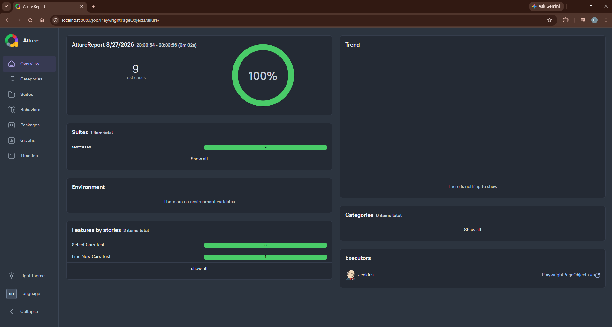

# Playwright Python Page Object Framework — CarWale

A data-driven web automation framework built with Python, Playwright, pytest, the Page Object Model (POM), Jenkins, and Allure Reports.

The test suite automates CarWale workflows for navigating to new-car pages, selecting multiple brands, validating page titles, and retrieving car names and prices from Excel-driven test data.

## Test results

- 9 automated test cases
- 100% passing in the latest Jenkins execution
- Allure features, steps, severity levels, and execution details
- Video and trace collection for debugging
- Screenshot attachment support for failed tests



## Technology stack

- Python 3.12
- Playwright
- pytest
- Page Object Model
- openpyxl for Excel-driven test data
- Allure Reports
- Jenkins

## Project structure

```text
PlaywrightPageObjects/
├── ConfigurationData/
│   └── conf.ini              # Application URL and element locators
├── docs/
│   └── allure-report.png     # Successful execution report
├── excel/
│   └── testdata.xlsx         # Data-driven test inputs
├── pages/                    # Page objects and reusable page actions
├── testcases/                # pytest test cases and fixtures
├── utilities/                # Configuration, Excel, and logging utilities
├── .gitignore
├── README.md
└── requirements.txt
```

## Automated scenarios

1. Navigate to the **Find New Cars** section.
2. Select BMW, MG, Toyota, and Honda using Excel test data.
3. Verify that each brand page displays the expected title.
4. Retrieve and print the available car names and prices.
5. Generate videos, Playwright traces, logs, screenshots, and Allure results.

## Local setup

### 1. Clone the repository

```bash
git clone <your-repository-url>
cd PlaywrightPageObjects
```

### 2. Create and activate a virtual environment

Windows:

```powershell
py -3.12 -m venv .venv
.venv\Scripts\activate
```

macOS or Linux:

```bash
python3 -m venv .venv
source .venv/bin/activate
```

### 3. Install dependencies and Playwright Chromium

```bash
python -m pip install --upgrade pip
python -m pip install -r requirements.txt
python -m playwright install chromium
```

## Run the tests

Run the complete suite:

```bash
python -m pytest -v -s testcases/Test_CarWale.py
```

Generate Allure result files:

```bash
python -m pytest -v -s testcases/Test_CarWale.py --alluredir=allure-results
```

After installing the Allure command-line tool, generate and open the report:

```bash
allure serve allure-results
```

## Jenkins configuration on Windows

This project was executed successfully through a Jenkins Freestyle job with the Allure Jenkins plugin.

Use this in **Build Steps → Execute Windows batch command**:

```bat
@echo off
cd /d "%WORKSPACE%"

if not exist ".venv\Scripts\python.exe" py -3.12 -m venv .venv

".venv\Scripts\python.exe" -m pip install -r requirements.txt
".venv\Scripts\python.exe" -m playwright install chromium
".venv\Scripts\python.exe" -m pytest -v -s testcases\Test_CarWale.py --alluredir="allure-results"
```

For **Post-build Actions → Allure Report**, set the results path to:

```text
allure-results
```

## Framework design

- Page objects keep test logic separate from locators and browser actions.
- `conf.ini` centralizes the base URL and XPath locators.
- `testdata.xlsx` supplies reusable brand and expected-title combinations.
- pytest fixtures manage browser, page, context, video, and trace lifecycles.
- Allure annotations organize test behavior, steps, features, and severity.
- Logging utilities capture framework activity for troubleshooting.

## Notes

- Chromium is enabled by default in the browser fixture.
- The test target is a public website; its UI and locators may change over time.
- Generated reports, traces, videos, logs, IDE settings, and virtual environments are intentionally excluded from Git.

